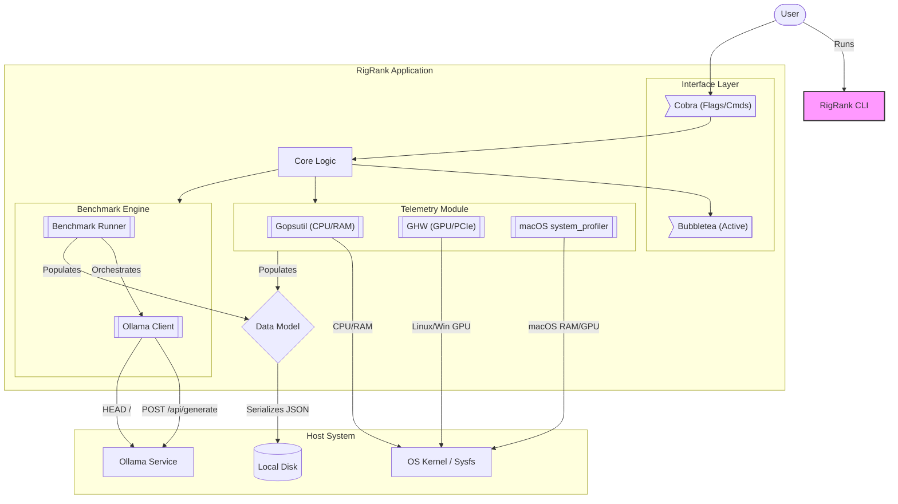

# RigRank CLI Architecture

This document visualizes the internal structure of the Go-based `RigRank` CLI tool and its interactions with the system.

## component Diagram (Go)

## Dependency Trace

| Module | Go Package | Purpose |
| :--- | :--- | :--- |
| **CLI Framework** | `github.com/spf13/cobra` | Command parsing, flags (`--model`, `--debug`), help generation. |
| **System Info** | `github.com/shirou/gopsutil` | Cross-platform CPU, Memory stats. |
| **Hardware Info** | `github.com/jaypipes/ghw` | Deep introspection (PCIe, GPU) for Linux/Windows. |
| **HTTP Client** | `github.com/go-resty/resty` | Robust HTTP client for talking to Ollama API. |
| **TUI / UX** | `github.com/charmbracelet/bubbletea` | Animated, interactive terminal UI. |
| **Spinner** | `github.com/charmbracelet/bubbles` | Loading indicators during benchmark. |
